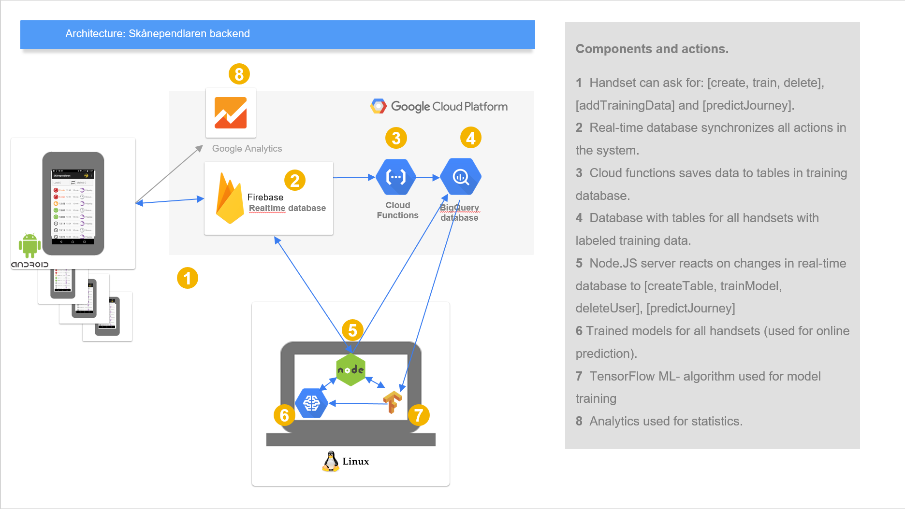

# ML-Backend connected to Skånependlaren commuter app.
Figure 1 shows the general outline of the ML-backend. Our overarching goal has been to keep training data and the ML-artifact separate for each user, this to be able to target privacy issues.

Our context gives us some metrics that we need to target. One is accuracy, others are response time and training time. Aspects of the accuracy is a function of many factors and will be central for further discussion during this project. To target the situation when a user starts the app we want to deliver journey predictions within seconds. Depending on the design retraining can be allowed to take hours or needs to be withon seconds. In an interactive training session the design can be done so the users don't expect new predictions until they are in the same situation next time. In a machine teaching session retraining can be expected more as fast as possible to the teacher can evaluate the training during the session.

**Figure 1:** *Backend that saves labelled data from the app and delivers predictions to the app. When new labelled data is entered by the user (this could be done explicitly or when the user selects a new route) the labelled data is saved and can be used for training. The coordination for this is done via the real-time database and cloud functions. Retraining is currently done one hour after the last use of the app. Predictions are initiated when the user/app uploads features (weekday, time, location, activity) to the real-time database and the Node.JS performs the predictions and returns the result via the real-time database.*

### Verification of backend functionality
Initially we made a technical verification that uses the backend and delivers predictions in the app. We reached our main metric for the backend and can deliver predictions in most cases in a few seconds. These test were mostly to verify the functionality. An animation that visualize a prediction can be seen on this [site](https://skanependlaren.firebaseapp.com/).

[BACK](../README.md)
