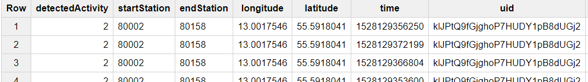
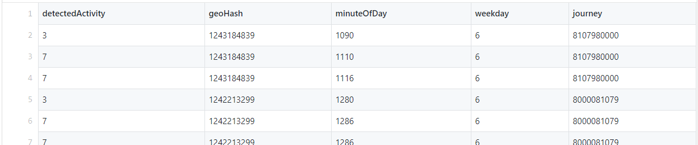
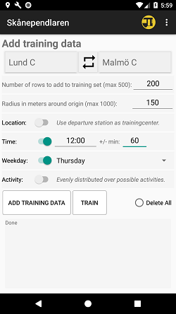

# Data creation and data preprocessing.
The Android app used in this project predicts journeys based on individual context-dependent data. As contextual parameters we selected weekday, time of day, location and activity.
* [App om Google play](https://play.google.com/store/apps/details?id=se.k3larra.alvebuss&hl=sv)
* [App description](https://skanependlaren.firebaseapp.com/)

### "Raw" data
Data created by the app before preprocessing has a format as shown in Figure 1.

**Figure 1:** *Data before preprocessing*
* detectedActivity is [activity](https://developers.google.com/android/reference/com/google/android/gms/location/DetectedActivity) given by the Android device.
* startStation and endStation are unique numbers given by [Skånetrafiken Open API](http://labs.skanetrafiken.se/api.asp).
* longitude and latitude is position given by the device.
* time is unix timestamp.
* [uid](https://firebase.google.com/docs/auth/android/anonymous-auth) is a unique id connected to the device and the current app installation. This uid is in our application not connected to any user data only to the installation and is created when the app connects to the real-time database [firebase](https://firebase.google.com/) for the first time.

### Preprocessed data
The raw data presented above is preprocessed in the app so it can be used for training an ML-artifacts and do journey predictions. To be able to perform journey classification origin destination is combined to one label. We convert our Unix timestamp to time of day and weekday. We convert latitude and longitude using a [geoHash](https://en.wikipedia.org/wiki/Geohash) algorithm so locations close to each other in the real world are numerically close.

After the preprocessing the data looks like the figure 2.

**Figure 2:** *Data after preprocessing*
* detectedActivity is [activity](https://developers.google.com/android/reference/com/google/android/gms/location/DetectedActivity) given by the Android device. The numbers has the following meaning
  * 0: IN_VEHICLE
  * 1: ON_BICYCLE
  * 2: ON_FOOT
  * 3: STILL
  * 4: UNKNOWN
  * 5: TILTING
  * 7: WALKING
  * 8: RUNNING
* [geoHash](ttps://en.wikipedia.org/wiki/Geohash) is longitude and latitude combined
* startStation and endStation are unique numbers given by [Skånetrafiken Open API](http://labs.skanetrafiken.se/api.asp)
* minuteOfDay represents minutes since midnight
* weekday from 0 to 6 where 0 is Sunday
* journey is the numbers for origin-destination combined as one longer string.

For training detectedActivity and weekday are treated as categorical input parameters and geoHash and minuteOfDay as continuous input parameters. The parameters are normalised prior to training.<!--Kolla om detta gäller cat pars-->

### Data sets created for the personas
The datasets created for the personas has been created using the app and the UI seen in the figure 3.

 
**Figure 3:** *UI used to create labelled data*

Using this UI it is possible to:
* Add one up to 500 labelled training rows in a bulk
* Rows are randomly and evenly place in a circle around a location.
* Location for the search can be either the departure station or the location for the device.
* Time is either current time or randomly and evenly distributed over a timespan.
* Weekday either is a selected day or evenly distributed over the week.
* Activity either is a selected activity or evenly distributed over all activities.

By using this UI datasets can be created rather effectively that can serve as training, validation, test and teaching sets for the personas. The UI also to some extent can serve as a simple machine teaching UI.

[BACK](../README.md)
