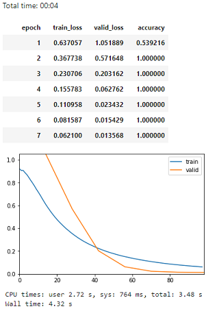
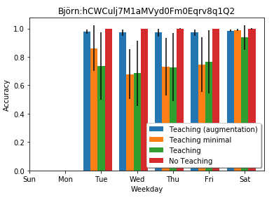

# Initial MT research approach
[Code](mt.ipynb)

Our focus, in this part of the project, is the user’s first encounter with the commuter app. In this situation, the app has no knowledge of the users commute patterns and cannot make any accurate predictions. The commute patterns could be learned over time but it would take some time and is complicated by [noisy data](../README.md#data-collection). In our approach we are interested in transferring the commuters knowledge of his/her commute patterns to the ML artifact and thus mitigate cold start problem.

Described below is an exploration and evaluation of an MT approach that starts with an initial Machine Teaching session. During this session the user adds his/her known travel patterns that will be used to train the model so journey predictions can be made accurately from first use of the app.

 The presentation on this page focus on the models performance for different teaching sets. We do not optimize the model in any way to optimize predictions for the teaching sets instead we keep our initial settings from our [ML verification](../ml/ml.md). We do this to evaluate the models robustness with respect to different distributions of teaching sets.

## Part 1: Functional test with teaching data.

 The app version and the interface used to create teaching data in this part can be seen in Figure 1.

**Figure 1:** *On the left the standard app is shown and details for one departure is expanded. In the second figure the app has received a contextbased prediction and departure times has been collected from the transport provider. In the figure on the right labelled teaching data can be added.*

To evaluate the approach some teaching sets were created for each user. One minimal set with only the most frequent patterns and one more verbose that targeted all scenarios for the persona. In the more verbose set, we created data rows by imagining the different combinations of arguments for each journey. We created the teaching sets using the UI on the right in figure 1.

 **Teachingsets created:** 
Andrea:
[Verbose](../data/ehaBtfOPDNZjzy1MEvjQmGo4Zv12_teaching_set.csv)
[Limited](../data/ehaBtfOPDNZjzy1MEvjQmGo4Zv12_teaching_set_minimal.csv)
 Björn:
[Verbose](../data/hCWCulj7M1aMVyd0Fm0Eqrv8q1Q2_teaching_set.csv)
[Limited](../data/hCWCulj7M1aMVyd0Fm0Eqrv8q1Q2_teaching_set_minimal.csv)
 Maria:
[Verbose](../data/tnK534JMwwfhvUEycn69HPbhqkt2_teaching_set.csv)
[Limited](../data/tnK534JMwwfhvUEycn69HPbhqkt2_teaching_set_minimal.csv)

To evaluate the models we used the same test sets as in our [ML verification](../ml/ml.md)

 **Test sets used:** 
[Andrea test set](../data/ehaBtfOPDNZjzy1MEvjQmGo4Zv12_test.csv) 
[Björn test set](../data/hCWCulj7M1aMVyd0Fm0Eqrv8q1Q2_test.csv) 
[Maria test set](../data/tnK534JMwwfhvUEycn69HPbhqkt2_test.csv)

### Results part 1: Training with hand made teaching sets.
The results of the evaluations were mixed and indicates that it is hard to create a good teaching set by hand. To handle the sometimes small teaching sets the rows were duplicated so at least 1000 rows are in the teaching sets. But the results are initially promising as can be seen in Figure 2 and for the individual users in Figure 3-7.

In Figure 1 the accuracy for the users journeys in the test sets are shown distributed over the week. For Andrea the results are good since she her travel patterns are regular on weekdays but more irregular on weekends. In her teaching sets, her weekend journeys are more correct than in the original data set. For Björn and Maria it becomes clear that the model can't distinguish the parameters with most information gain from the ones that holds limited information. This indicates that it is important to augment the training data so the parameters that carries less information is more random.

**Figure 2:** *The accuracy and SD for the accuracy distributed over a week for the different personas. The models used are trained using the teaching sets and evaluated towards the same test set for each user.*

In the figures below more details around the training result for each users is presented.

#### Minimal teaching set

**Andrea**

**Figure 3:** *For Andrea only her commute patterns to school is in the teaching set as seen in the confusion matrix. The accuracy is acceptable since the bulk of Andreas journeys are to and from school. Accuracy on test set 0.89*

**Björn**

**Figure 3:** *For Björn the result is unclear and the journeys are confused with each other. This can also be seen in Figure 1. Accuracy on test set 0.57*

**Maria**

**Figure 4:** *For Maria the result can be acceptable, the teaching sets includes some of her irregular journeys on the evenings and correctly predicts many of her commutes to school in Malmö. Accuracy on test set 0.86*

#### Verbose teaching set

**Andrea**

**Figure 5:** *Some of Andreas evening are correctely predicted but since she has no distinkt commute pattern it is hard to predict any of them with high accuracy. The total accuracy for the test set is 0.92 since the bulk of journeys are on weekdays to school*

**Björn**

**Figure 6:** *For Björn the result is really mixed and many journeys are confused with each other giving an accuracy on the test set of 0.74.*

**Maria**

**Figure 7:** *For Maria the verbose teaching set worked well. Accuracy on test set 0.98*

## Part 2: Augmented teaching set
To overcome some of the limitations in the functional test above a teaching UI is created that automatically augment the data. The interface in figure 2 was used. the data is agmented in the following way.

 Teachingsets created: 
Andrea:
[Augmented](../data/ehaBtfOPDNZjzy1MEvjQmGo4Zv12_teaching_set_aug.csv)
 Björn:
[Augmented](../data/hCWCulj7M1aMVyd0Fm0Eqrv8q1Q2_teaching_set_aug.csv)
 Maria:
[Augmented](../data/tnK534JMwwfhvUEycn69HPbhqkt2_teaching_set_aug.csv)

### Andrea

Accurracy test set: 0.88

### Björn

Accurracy test set: 1.0

### Maria

Accurracy test set: 0.99
