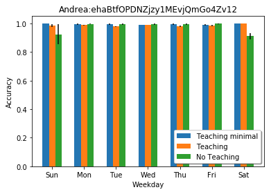
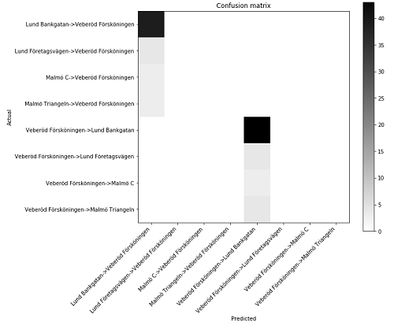
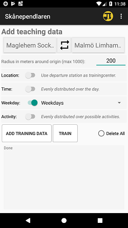
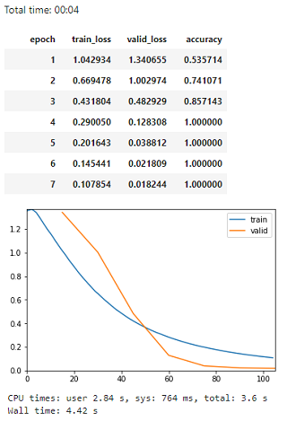

### Initial MT research approach
[Code](mt.ipynb)
Our focus in this part of the work is on the users first encounter with the app. In this situation the app has no knowledge of the users commute patterns and cannot make any accurate predictions. The commute patterns could be learned over time but it would take some time until enough training data has been collected to make accurate journey predictions. In our initial approach we are interested of transferring the commuters knowledge of his/her commute patterns to the ML artifact. Initially we want to explore and evaluate a MT approach that starts with an initial Machine Teaching session. In this session the user adds known travel patterns and that can be used to train the model so predictions can be made from first use.
The training is done using the same model and settings as in [ml verification](../ml/ml.md)

**Figure 1:** *In the figure on the left the standard app is shown and details for one departure is expanded. In the second figure the app has received a contextbased prediction and departure times has been collected from the transport provider. In the figure on the right labelled training data can be added.*

### Functional test with teaching data.
To evaluate the approach some teaching sets were created for each user. One minimal with only the most frequent patterns and one more verbose that targeted all scenarios for the persona. The initial teaching sets were created using the UI on the right in figure 1.
 Teachingsets created: 
Andrea:
[Verbose](../data/ehaBtfOPDNZjzy1MEvjQmGo4Zv12_teaching_set.csv)
[Limited](../data/ehaBtfOPDNZjzy1MEvjQmGo4Zv12_teaching_set_minimal.csv)
 Björn:
[Verbose](../data/hCWCulj7M1aMVyd0Fm0Eqrv8q1Q2_teaching_set.csv)
[Limited](../data/hCWCulj7M1aMVyd0Fm0Eqrv8q1Q2_teaching_set_minimal.csv)
 Maria:
[Verbose](../data/tnK534JMwwfhvUEycn69HPbhqkt2_teaching_set.csv)
[Limited](../data/tnK534JMwwfhvUEycn69HPbhqkt2_teaching_set_minimal.csv)

 Test sets used: 

The results of the evaluations were mixed and somtimes hard to create a optimal teaching set by hand. But the results are quite promising for the users Andrea and Maria. THhe......

Training results and confusion matrix

Minimal teaching set

Andrea

Accuracy 0.89

Björn

Accuracy 0.57

Maria

Accuracy: 0.86

Verbose teaching set

Andrea

Accurracy 0.92

Björn

Accuracy 0.74

Maria

Accurracy 0.98

**Figure 1:** *Accuracy for persona test set. The models are trained using the teaching sets referenced above and the accuracy is plotted over weekdays. The black line is standard deviation for the accuracy. *

#### First MT interface
To overcome some of the limitations in the functional test above a teaching UI is created that automatically augment the data. Data augmentation is generally a way to get more data out of limited data. In our case creating extra data points over a time interval or over multiple locations can give better accuracy [REFS].
The interface in figure 2 was used, the data is agmented in the following way..........

 Teachingsets created: 
Andrea:
[Augmented](../data/ehaBtfOPDNZjzy1MEvjQmGo4Zv12_teaching_set_aug.csv)
 Björn:
[Augmented](../data/hCWCulj7M1aMVyd0Fm0Eqrv8q1Q2_teaching_set_aug.csv)
 Maria:
[Augmented](../data/tnK534JMwwfhvUEycn69HPbhqkt2_teaching_set_aug.csv)

### Andrea

Accurracy test set: 0.88

### Björn

Accurracy test set: 1.0

### Maria

Accurracy test set: 0.99

## User study MT approach handling cold start situation
In progress
