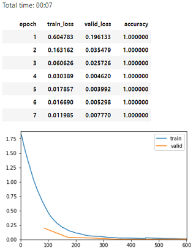
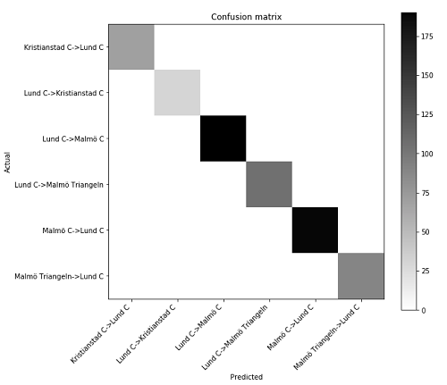
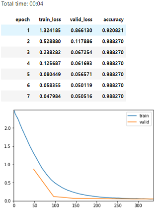
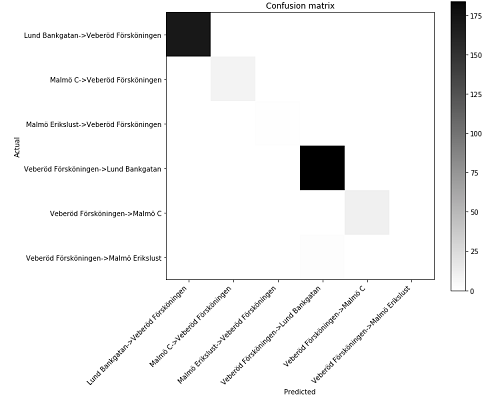
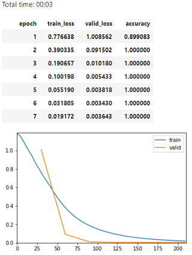
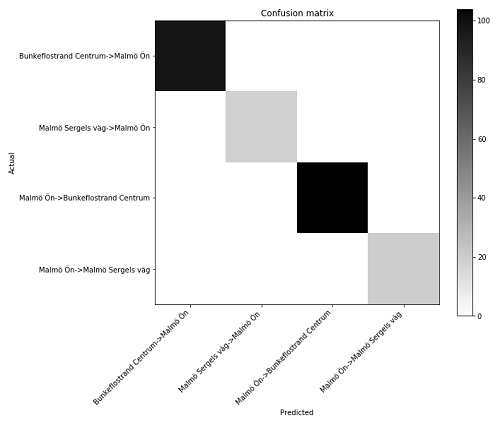

# About Machine Learning and Commuting
In this setup, we are not interested in a detailed performance test since we at this stage only can estimate the requirements the usage, context and app design will result in. At this stage interested in metrics around accuracy, time for predictions and training time. As mentioned in [backend](../backend/backend.md) we need an ML-model that converges for our data and inference times that are as short as possible and model training time shorter than 10 minutes. Regarding inference time, it is only one part in the chain of events from the request of journey prediction until the transport provider delivers departure times.

#### Verification: ML functionality for our context
The focus is not only on optimising the ML algorithm for a statical dataset, other parameters that has to be taken into account as for example.

* Generalizability of the algorithm so it can handle a varying amount of data, concept drift and different use patterns.
* Online inference
* Scalability so each user can have her/his own model.
* Abstraction level of the ML framework

In our framework evaluation we initially worked with [tensorflow](https://www.tensorflow.org) and tried out different ML algorithms by using [estimators](https://www.tensorflow.org/guide/estimators). Given our data and our competence in the area these solutions took a lot of time especially in parameter normalisation and tuning and saving the models correctly so inference could be made online.

In parallel we evaluated [Fastai](https://www.fast.ai/) framework that builds on [PyTorch](https://pytorch.org/) and found that the abstraction level that framework represents was more in line with our needs. The evaluations below uses Pytorch 1.0 and Fastai 1.0.

Our initial tests with fastai [tabular learner](https://docs.fast.ai/tabular.html) and a standard neural network with [two hidden layers](ml/baseline.ipynb) gave us predictions that indicated it will fullfill our expectations regarding accuracy. Initial tests also indicated that inference time and training time is in line withour needs.

To evaluate this in a more structured way we used our [personas](../README.md#Personas) and senarios.

### Fastai 1.0 Pytorch 1.0 tests.
In the tests outlined below uses the persona data created for one year use and the test set created from the same distribution.
Visit the pages for the individual personas for more information:
* [Maria](../personas/Maria.md)
* [Andrea](../personas/Andrea.md)
* [Björn](../personas/Bjorn.md)

Training result for the 3 personas training over 7 epochs on a Neural network with two hidden layers with 200/100 neurons. Code details for evaluation can be found [here](ml_verification.ipynb). The training could go on further since there is only a little amount of overfitting for Andrea. Training time is less than 10 seconds. Time for inference is less than ?????

**Figure 1:** *Maria training result, prediction accuracy over test set was 1.000, all 3 scenarios correct predicted. Confusion matrix.*

**Figure 2:** *Andrea training result, prediction accuracy over test set was 0.995, all 3 scenarios correct predicted. Confusion matrix.*

**Figure 3:** *Björn training result, prediction accuracy over test set was 1.000,  all 3 scenarios correct predicted. Confusion matrix.*

_Hardware & Software used:_
Google cloud VM instance
* 2 vCPU, 13GB memory
* 1 GPU x NVIDIA Tesla K80
* OS Debian 9
* PyTorch 1.0
* Fastai 1.0
* Python 3.7

### Result and discussion
Given our results fastai and tabular learner meets our expectations regarding [accuracy in predictions, time to train and response time for inference](../backend/backend.md). We estimate that these metrics are sufficient to continue with the project and no further technical investigations are needed at this stage.
